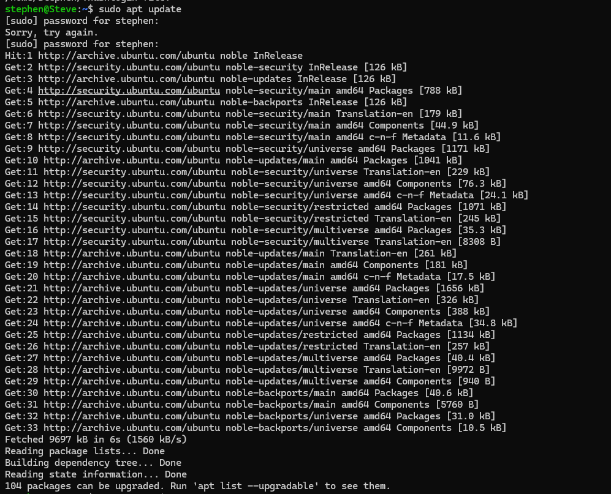

# Ethical Hacking Task 02
## Network Scanning & Service Enumeration

---

## Student Information

**Name:** Stephen J  
**Internship:** White Band Associates  
**Task:** Ethical Hacking Task 02  
**Topic:** Network Scanning & Service Enumeration  
**Operating System:** Ubuntu Linux  
**Tool Used:** Nmap

---

# Objective

The objective of this task is to understand the Network Scanning and Service Enumeration phase of Ethical Hacking. Using Nmap, this task demonstrates how to identify active hosts, open ports, running services, service versions, and operating system information in a safe and authorized environment.

---

# Software Requirements

- Ubuntu Linux
- Nmap
- Terminal
- Git
- GitHub

---

# Commands Executed

## 1. Verify Nmap Installation

```bash
nmap --version
```

**Purpose:**  
Verifies that Nmap is installed successfully.

---

## 2. Scan Local Machine

```bash
nmap localhost
```

or

```bash
nmap 127.0.0.1
```

**Purpose:**  
Scans the localhost and displays open ports and running services.

---

## 3. Service Version Detection

```bash
nmap -sV localhost
```

**Purpose:**  
Detects the version information of services running on open ports.

---

## 4. Operating System Detection

```bash
sudo nmap -O localhost
```

**Purpose:**  
Attempts to identify the operating system using OS fingerprinting.

---

# Screenshots

The following screenshots are included in the **Screenshots** folder.

### Screenshot 1 – Nmap Installation
Shows successful installation of Nmap.

File:
```

```

---

### Screenshot 2 – Nmap Version
Displays the installed version of Nmap.

File:
```
Screenshots/02_version.png
```

---

### Screenshot 3 – Localhost Scan
Shows the open ports and running services detected on localhost.

File:
```
Screenshots/03_scan.png
```

---

### Screenshot 4 – Service Version Detection
Shows the version details of detected services.

File:
```
Screenshots/04_service_Version.png
```

---

### Screenshot 5 – Operating System Detection
Shows the operating system identified by Nmap.

File:
```
![Screenshots/05_detection.png]
```

---

# Project Folder Structure

```
Ethical_Hacking_Task_02_Stephen_J
│
├── README.md
├── Scan_Report.pdf
├── Research_Notes.txt
└── Screenshots
    ├── 01_Nmap_Installation.png
    ├── 02_Nmap_Version.png
    ├── 03_Localhost_Scan.png
    ├── 04_Service_Version.png
    └── 05_OS_Detection.png
```

---

# Learning Outcomes

After completing this task, I was able to:

- Install and verify Nmap successfully.
- Perform a basic network scan on localhost.
- Identify open ports and running services.
- Detect service version information.
- Perform operating system detection.
- Understand the importance of network scanning in ethical hacking.
- Learn safe and authorized scanning practices.

---

# Conclusion

This task provided practical experience with the Nmap network scanning tool. I learned how to discover open ports, identify running services, detect service versions, and perform operating system fingerprinting. The task also emphasized the importance of securing unnecessary open ports, regularly monitoring systems, and following ethical hacking principles by scanning only authorized systems.

---

# Repository Contents

- README.md
- Scan_Report.pdf
- Research_Notes.txt
- Screenshots Folder

---

## Author

**Stephen J**

**White Band Associates – Ethical Hacking Internship**
